# Online study platform

# **Tasks**

## **Task 1. Base SELECT**

1. Remove all students who registered after 2024-01-01.

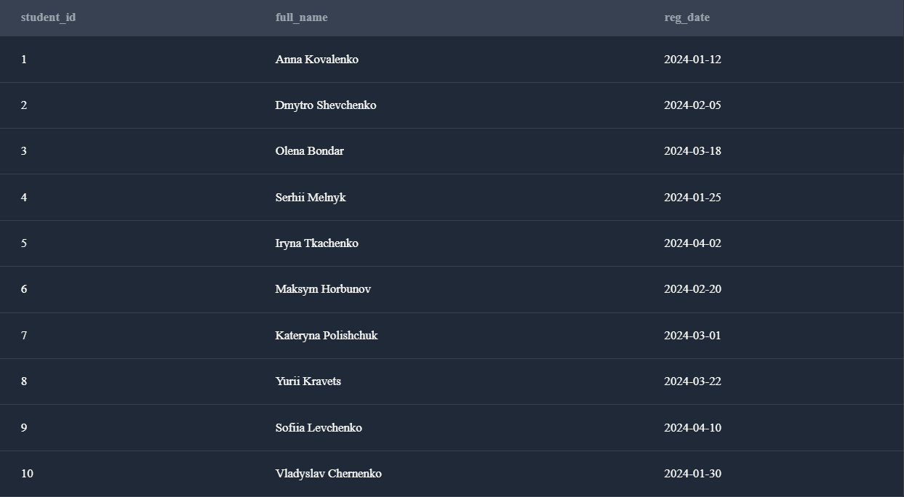

2.Display all courses in the 'Data Science' category.

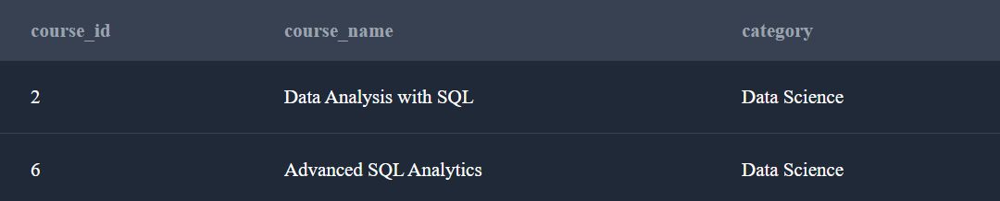

## **Task 2. Grouping and aggregation**

1. Count the number of students in each city.

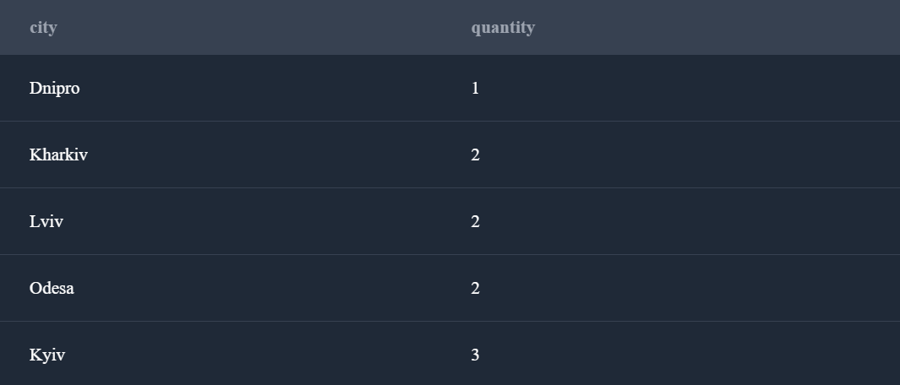

2. Count the number of courses in each category.

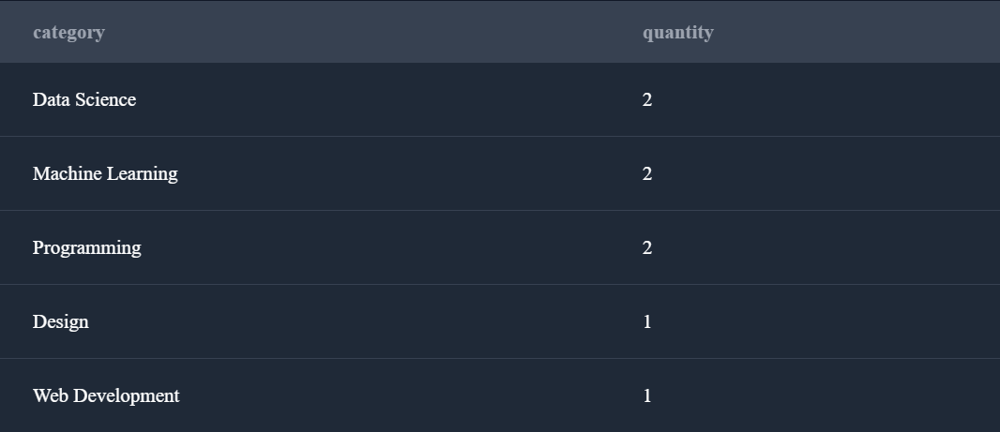

3. Calculate the average grade for each course.

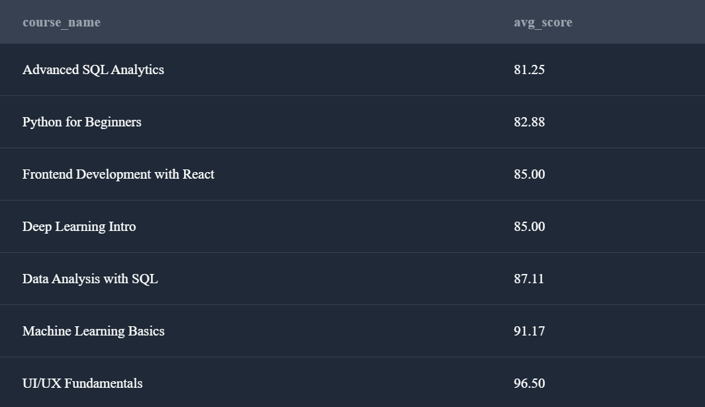

## **Задача 3. JOIN‑аналіз**

1. Display a list of courses along with the names of the instructors.

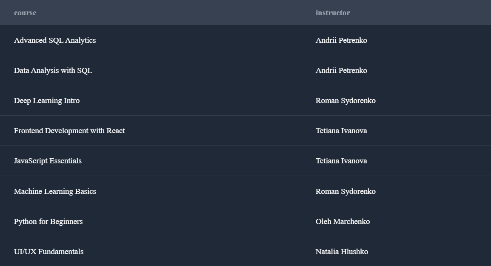

2. List students and the names of the courses they are enrolled in.

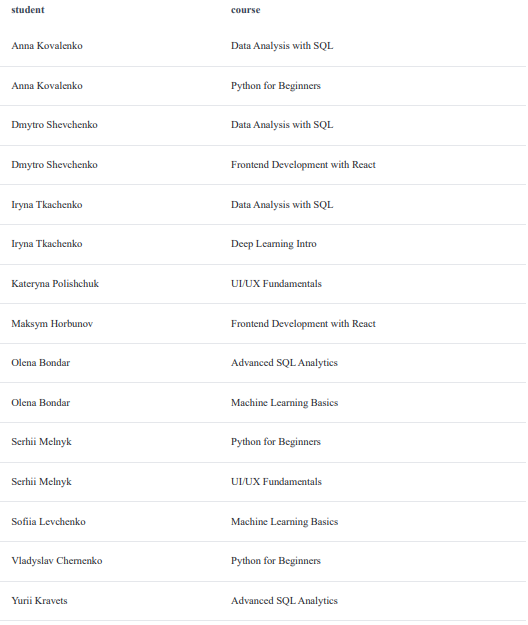

3. Count how many students each teacher has.
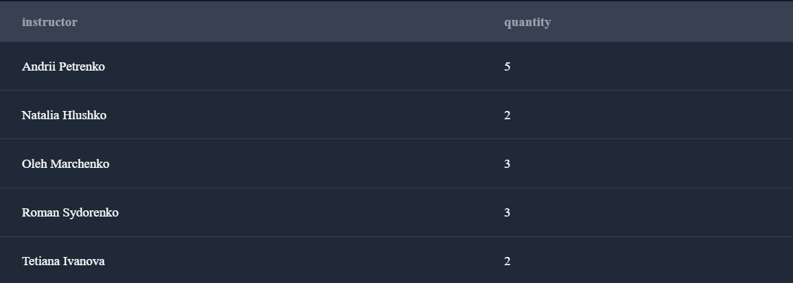

## **Task 4. Progress analytics**

1. Calculate the average grade of each student.

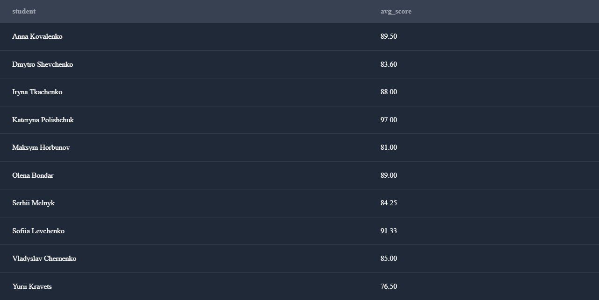

2. Calculate the percentage of lessons completed for each course.

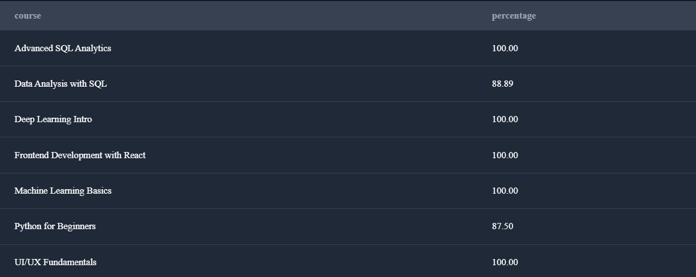

3. Find students who have completed all lessons in their courses.

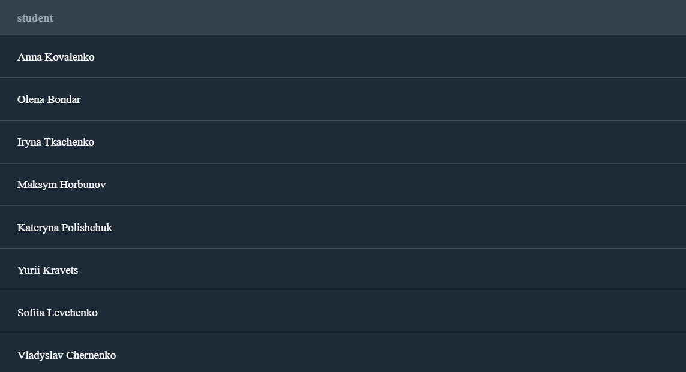

## **Task 5. Window functions**

1. For each course, determine the student rating by grade point average.

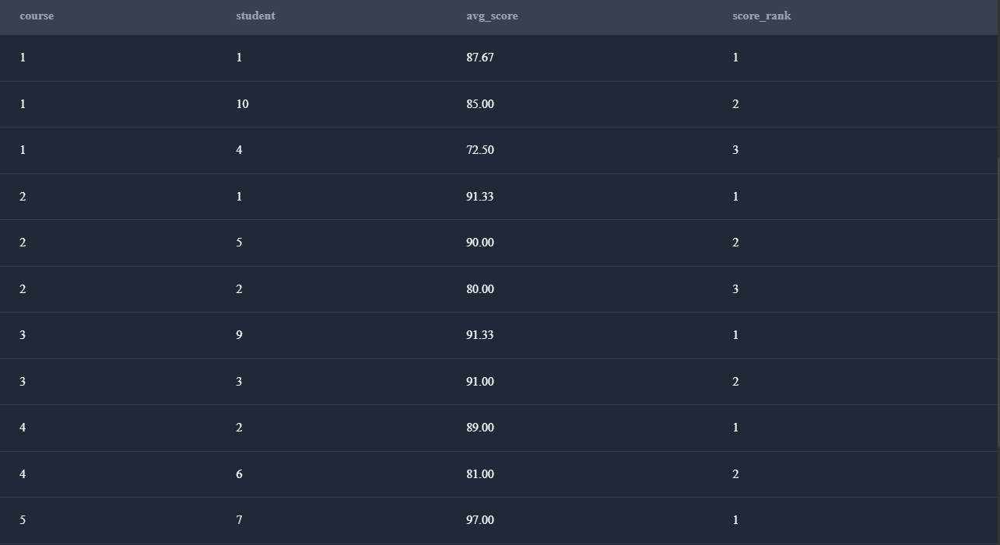

2. Count the cumulative number of lessons completed by a student in chronological order.

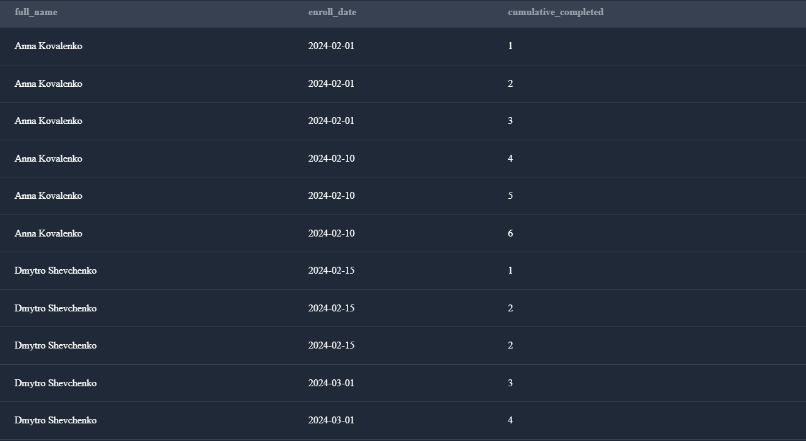

3. For each course category, find the top 1 course by number of students.

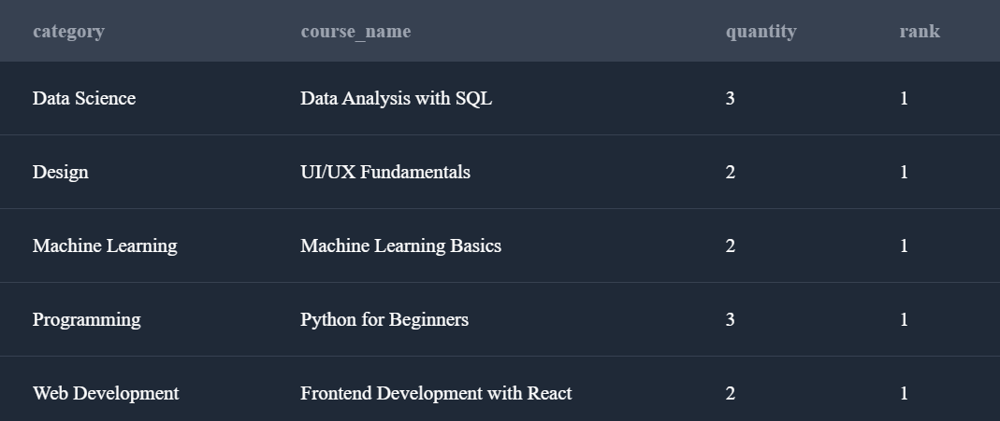

# **Database structure**

The online platform has the following tables:

### **students**

| Field | Type | Description |
| --- | --- | --- |
| student_id | SERIAL PK | Unique student ID |
| full_name | TEXT | Full name |
| city | TEXT | City |
| reg_date | DATE | Registration date |

### **instructors**

| Field | Type | Description |
| --- | --- | --- |
| instructor_id | SERIAL PK | Unique instructor ID |
| full_name | TEXT | Full name |
| specialization | TEXT | Specialization |

### **courses**

| Field | Type | Description |
| --- | --- | --- |
| course_id | SERIAL PK | Course ID |
| course_name | TEXT | Name |
| category | TEXT | Category |
| instructor_id | INT FK | Instructor |

### **enrollments**

| Field | Type | Description |
| --- | --- | --- |
| enrollment_id | SERIAL PK | Enrollment ID |
| student_id | INT FK | Student |
| course_id | INT FK | Course |
| enroll_date | DATE | Enrollment date |

### **progress**

| Field | Type | Description |
| --- | --- | --- |
| progress_id | SERIAL PK | Progress ID |
| enrollment_id | INT FK | Enrollment |
| lesson_number | INT | Lesson number |
| score | NUMERIC | Score |
| completed | BOOLEAN | Is completed |

##  Analytical Insights & Improvements

As a data analyst, I analyzed key aspects of an online learning platform, including student activity, course distribution, instructor workload, and learning progress. The analysis revealed popular course categories, geographic distribution of students, average course performance, and student engagement based on lesson completion. Window functions were applied to rank students and identify top-performing courses within each category.

The database structure is logical and well-designed. As an improvement, I propose extracting the `specialization` field from the `instructors` table into a separate reference table. This would enable easier search and more flexible analytics, as well as support assigning multiple specializations to a single instructor. Additionally, I consider it important to implement cascade deletion of course progress records when deleting students to maintain data consistency and prevent orphaned records.
